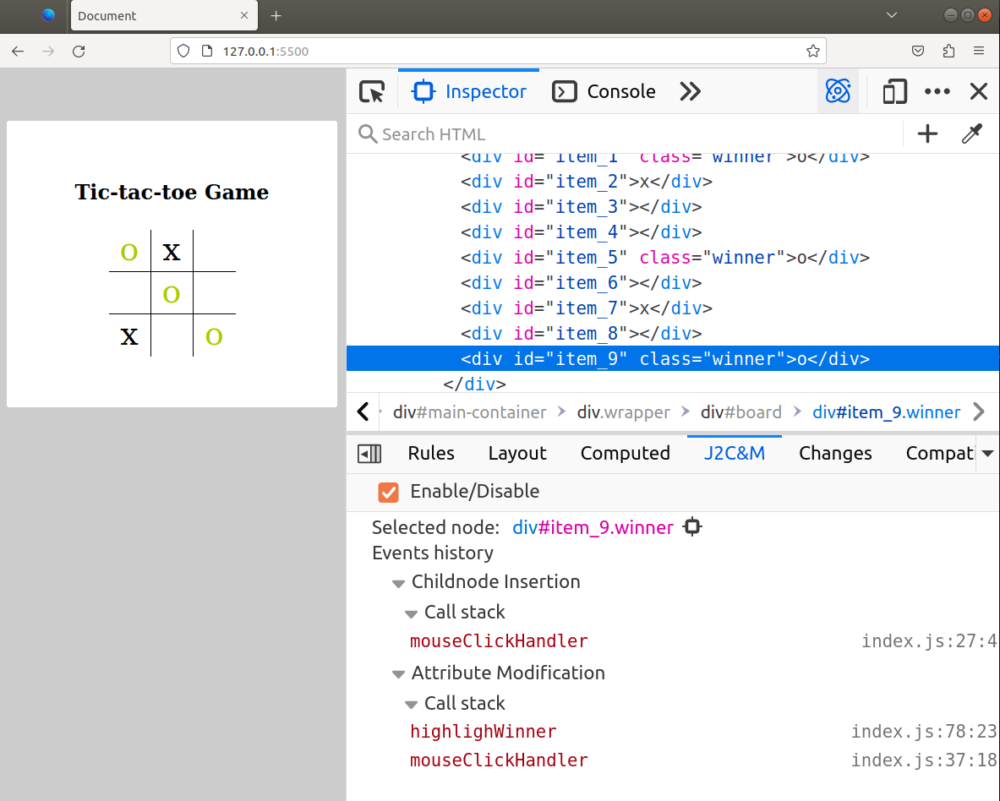
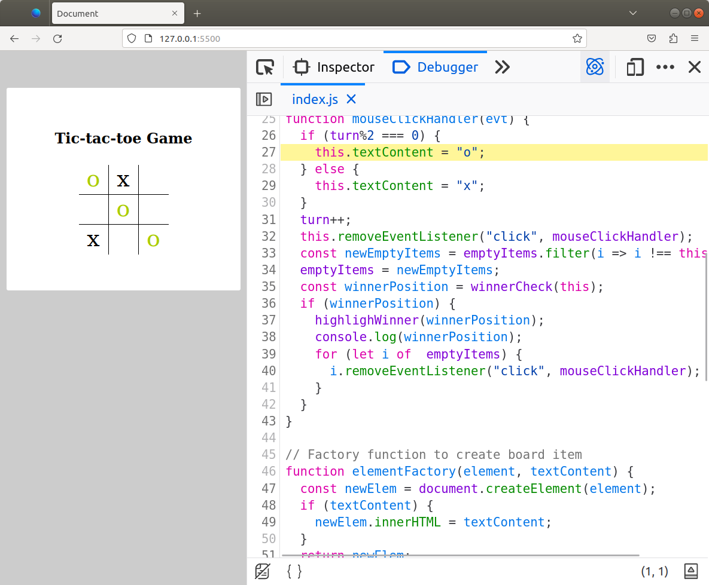

# A new Debugging tool in Firefox called Jump to Construction and Mutation(J2C&M)
## Note
To avoid problem about License and big size of source code in Firefox, so we only upload a diff file in this repository

You can build firefox from source code and add changes in diff file into source code to run J2C&M
## Build firefox from source code
Below link will show all of thing you need to build firefox on your pc and document to understand how firefox works
```
https://firefox-source-docs.mozilla.org/setup/index.html
```
## Jump to Construction and Mutation
### Overview
J2C&M is tool that create a immediate connection between HTML element displayed in web page and corresponding javascript code modified HTML element.

Below, we use tic-tac-toe game as test case to show you how J2C&M works in Firefox developer tools panel.

#### Enable and Disable J2C&M in devtools inspector panel
When you enable J2C&M that will add some of event listener hook to listen whenever HTML element changes during run-time, and save these changes as an events. Depending on how many time you modified HTML via JavaScript that will slow down page loading.

You can disable J2C&M when you not need to use it.

#### View dynamic change of specific HTML element
When you pick an element from web page, all of changes of that element will display like picture below.

Event history: show all changes of that element

CallStack: show call stack status when event happened


Note: you can click on text at right side of function to jump to JS code in Debugger panel.



